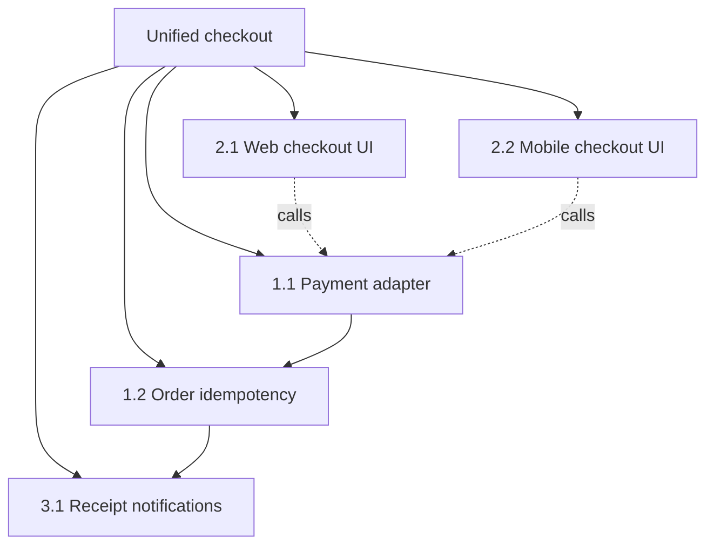

# `/uncle-dev-big-idea` — usage

`/uncle-dev-big-idea` maps a large initiative into its **big impacted items** and a **visual
breakdown** so you can see the whole change *before* writing any spec. It runs the
[`uncle-dev-initiative-map`](./SKILL.md) skill.

It is the step **before** PRDs and specs. It does **not** write specs, tasks, or code, and it does not
run HLD/LLD/EARS or a pre-mortem. Each big item it produces hands off downstream to `uncle-dev-grill`
(PRD) or `uncle-dev-spec` (spec); each flagged decision to `uncle-dev-documentation-and-adrs` (ADR).

## When to reach for it

- Scoping a big initiative that spans multiple apps/services/components.
- You need to *see* the shape and main workstreams of a change before committing to specs.
- Deciding how to break an initiative into independently-workable pieces.
- Greenfield or brownfield; one repo or many.

Not for: writing one component's spec (use `uncle-dev-grill` → `uncle-dev-spec`), or breaking an
approved change into tasks (use `uncle-dev-planning-and-task-breakdown`).

## Invocation

```text
/uncle-dev-big-idea <objective>
```

`<objective>` can be a sentence, a paragraph, or a path to a doc. If you omit it, the command asks for
the objective (and which repos/platforms it spans, if multi-repo).

### Examples

```text
# 1. Brownfield feature across web + API
/uncle-dev-big-idea Add a unified checkout that works the same on web and mobile,
backed by a new payment provider.

# 2. From an existing design doc
/uncle-dev-big-idea docs/hld/marketplace-payouts.md

# 3. Greenfield project
/uncle-dev-big-idea Greenfield: a multi-tenant analytics platform — ingest, dashboards, alerts.

# 4. Multi-repo / cross-platform initiative (name the repos)
/uncle-dev-big-idea Roll out SSO across the web app, the mobile app, and the admin console.
Repos: acme-web, acme-mobile, acme-admin, acme-auth.
```

## What it produces

All under `.uncle-dev/initiative-maps/`:

| Artifact | Path | Purpose |
|---|---|---|
| **Tracker** (canonical) | `<slug>-tracker.yaml` | Machine-readable: items, tiers, deps, critical paths, milestones, ADR register |
| **Map** (rendered) | `YYYY-MM-DD-<slug>.md` | Human view: quick-view table + Mermaid diagram + per-item detail |
| **Stubs** | `<slug>/<item-slug>.md` | One placeholder per big item — the four lenses + deps + owner refs |

Every big item carries four one-line lenses — **Why / What / What if / How** — a stakeholder + SME, and
an ADR flag when it hides a real technical decision.

## Sample output (excerpt)

For `/uncle-dev-big-idea Add a unified checkout across web + mobile with a new payment provider`:

**Quick view** (from the rendered map):

| ID | Item | Tier | Type | Status | Depends on | ADR? | Stakeholder | SME |
|----|------|------|------|--------|-----------|------|-------------|-----|
| 1.1 | Payment provider adapter | 1 MUST HAVE | service | pending | — | ADR-01 | TBD | a.lee |
| 1.2 | Order idempotency | 1 MUST HAVE | service | pending | 1.1 | ADR-01 | TBD | a.lee |
| 2.1 | Web checkout UI | 2 HIGH VALUE | ui | pending | 1.1 | — | TBD | r.gomez |
| 2.2 | Mobile checkout UI | 2 HIGH VALUE | ui | pending | 1.1 | — | TBD | s.park |
| 3.1 | Receipt notifications | 3 LATER | service | pending | 1.2 | — | TBD | TBD |

**Breakdown**:



**Item detail** (one item):

```markdown
### 1.1 Payment provider adapter
- **Why:** single provider behind both platforms · **What:** new adapter + tokenized charge flow
- **What if:** wrong abstraction here forces a rewrite of both UIs later
- **How:** wrap the provider SDK behind the existing PaymentGateway port
- **Touches:** acme-api/payments, shared/payment-port
- **Depends on:** none · **Interacts with:** 1.2 (charge → order), 2.1/2.2 (UIs call it)
- **ADR:** ADR-01 · **Stakeholder:** TBD · **SME:** a.lee
- **Stub:** .uncle-dev/initiative-maps/unified-checkout/payment-provider-adapter.md
```

**ADRs needed**:

| ADR | Decision (as a question) | Items | Options | Owner |
|-----|--------------------------|-------|---------|-------|
| ADR-01 | Charge→order: synchronous call or async event? | 1.1, 1.2 | sync REST / async events | a.lee |

## What to do next

1. Skim the map and the diagram — confirm the big items and tiers look right.
2. For each flagged ADR, run `/uncle-dev-documentation-and-adrs` to settle the decision.
3. For each item ready to build, run `/uncle-dev-spec` (or `/uncle-dev-grill` first for a PRD) on its
   stub — the stub's four lenses seed the spec.
4. Then `/uncle-dev-plan` → `/uncle-dev-build` per component, in the tracker's tier/critical-path order.
